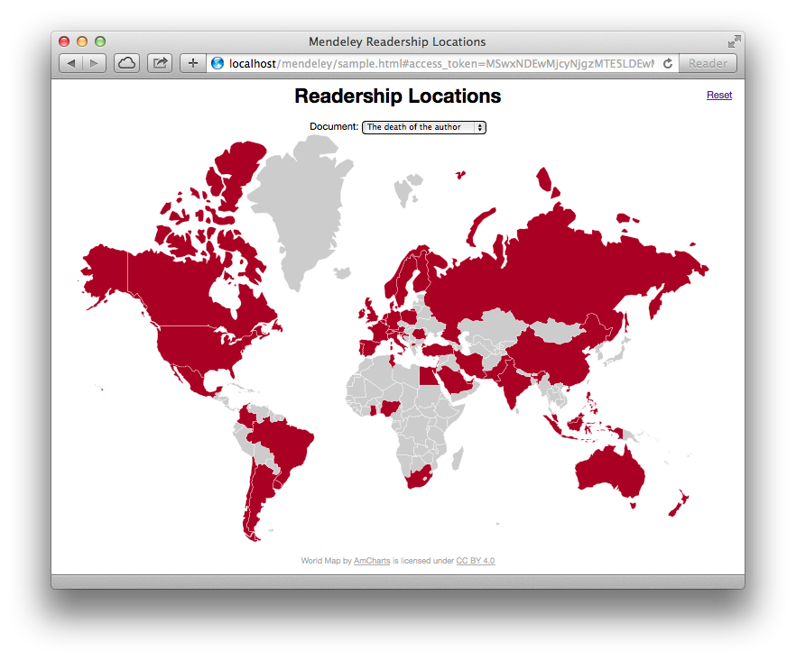

## Walk-through: step by step

This walk-through is designed to illustrate common tasks and situations an application will perform when manipulating resources through the Mendeley API. The walk-through is based on the sample code [Readership Locations](../code/sample_code.html), written in JavaScript. 

The Readership Locations sample application displays a world map showing the regions where a document has been read. The application lists the documents from a user library and for each document selected will request the catalog document using a [Digital Object Identifier](../overview/platform_objects.html#documents) (DOI) value to link the catalog document to the document in the user's library.

The javascript application performs a number of tasks:

1. Conditionally display either a usage map, or an authorization prompt, depending on the presence of an OAuth access token
* Present the authorization panel to the user
* Extract and verify the OAuth credentials after a redirect
* Request the user's documents and use the results to populate a menu
* Request catalog document statistics and use the results to mark regions on a map

This walk-through will examine each of these tasks in detail and explain how the Mendeley API is used to accomplish each task. 

**Note**: *before running the example you should ensure you have a Mendeley account and your library contains a number of documents. Only documents with a DOI identifier will be displayed in the app. Use the tool <a href="../tools/populator.html" target="_blank">Populator</a> to insert appropriate sample documents into the user library.*

### 1. Conditionally display either a usage map or an authorization prompt

The HTML page, once loaded, invokes the JavaScript function `init()` using the HTML document's `onload` handler set in the HTML. 

	function init() {
	  extractOAuthParams();
	  if (oauth_params == null) {
		document.getElementById('usage').style.display = "none";
		document.getElementById('login').style.display = "block";
		} else {
			document.getElementById('usage').style.display = "block";
			document.getElementById('login').style.display = "none";
			loadUserDocuments();
		}
	}

The function first attempts to extract OAuth data from the URL. If no data is extracted, the page has been loaded into the browser by a user either following a link or opening the page directly. If OAuth data is extracted, the page was loaded in response to an authorization request.

If the OAuth data is not yet available, hide the map and display the log in prompt by setting CSS properties. If OAuth data is available, display the map and hide the log in prompt and also initiate the loading of documents from the user library. 

### 2. Present the authorization panel to the user

As outlined in [Authorization](../reference/topics/authorization_overview.html), the [client credentials](../reference/topics/authorization_client_credentials.html) authorization flow is best suited to a JavaScript application running in the browser. If an access token is not available to make API requests, the user is prompted to authorize the provision of a new access token by the API's OAuth service.

An HTML *div* element, acting as a user interface button, invokes the JavaScript function `displayAuthorization()`. The function synthesizes a URL and loads the page into the browser.

	function displayAuthorization() {
		var auth_url = mendeley_auth_endpoint + "response_type=token&scope=all";
		auth_url = auth_url + "&client_id=" + mendeley_app_id;
		auth_url = auth_url + "&redirect_uri=";
		auth_url = auth_url + encodeURIComponent(document.location.origin + document.location.pathname);
		
		var oauth_state_context = Math.random() * new Date();
		auth_url = auth_url + "&state=" + oauth_state_context;
		document.cookie = "oauth_state_context=" + oauth_state_context;
		
		document.location = auth_url
	}
	
The function composes the URL from the API OAuth endpoint, appends the client application ID and uses the current location as the redirect URL. The redirect URL is set to the current location to reload the same page once the authorization process is complete. The current location of the HTML page must match the value used in [application registration](../reference/topics/application_registration.html) so any query string parameters or URL fragment identifiers are removed by recomposing the URL.

To ensure the page only performs actions on behalf of the user who recently authorized, so preventing [cross site request forgery](http://en.wikipedia.org/wiki/Cross-site_request_forgery), a random value is sent with the request in the `state` field of the query string. The same value is persisted in a client-side cookie for comparison later when the page is reloaded as the authorization response. 

Finally, the completed URL is loaded into the browser.

### 3. Extract and verify the OAuth credentials after a redirect

On every page load, JavaScript attempts to extract OAuth access tokens from the URL. On redirection from the authorization service, the URL will contain OAuth credentials in a URL fragment identifier:

	http://host/path/to/file.html#access_token=MSwxNDEwMj…RUellRbmM&state=1113800798425.0056

The function `extractOAuthParams()` is invoked by the `init()` function to parse the URL fragment identifier. The fragment identifier is deserialized into a JavaScript object and, for a successful authorization, is stored in the global variable `oauth_params` with the members `access_token` and `state`.

	function extractOAuthParams() {
		if (location.hash == "") return;
		oauth_params = {};
		queryString = location.hash.substring(1);
		regex = /([^&=]+)=([^&]*)/g;
		while (m = regex.exec(queryString)) {
		  oauth_params[decodeURIComponent(m[1])] = decodeURIComponent(m[2]);
		}
		
		if (oauth_params.state !== getCookie("oauth_state_context")) {
		  alert("Check for Cross-site request forgery");
		  oauth_params = null;
		}
	}

The function finally checks the value of the state parameter matches the value set when the original authorization request was sent. This determines if this credential extraction is in response to a request originating from this page. In the previous task the value was persisted in a cookie and the utility JavaScript function `getCookie(name)` fetches the previous state value. If the values do not match, the function removes any OAuth access token and the user will be prompted to reauthorize by the `init()` function.

### 4. Request the user's documents and use the results to populate a menu

Once the HTML page has loaded, and OAuth credentials have successfully been extracted, the JavaScript function `loadUserDocuments()` is invoked by `init()`. This function performs an AJAX request to fetch the documents in the user's library using the API resource `/documents`.

	function loadUserDocuments() {
	  var xmlhttp = new XMLHttpRequest();
	  var data;	
	  xmlhttp.onreadystatechange = function() {
		// function contents ommitted from sample. see below
	  }
	  
	  xmlhttp.open("GET", "https://api.mendeley.com/documents", true);
	  xmlhttp.setRequestHeader("Authorization", "Bearer " + oauth_params.access_token);
	  xmlhttp.setRequestHeader("Accept", document_version_type); // set the resource version
	  xmlhttp.send();
	}

Before sending, the API request is configured by:

* setting the URL to the Mendeley API endpoint and setting the HTTP method to `GET`
* [authorizing](../reference/topics/authorization_overview.html) using the OAuth access token with a `Bearer` authorization scheme in a standard HTTP `Authorization` header
* requesting a specific [version](../reference/topics/versioning.html) of documents, `application/vnd.mendeley-document.1+json`, to ensure the JavaScript function processing the results continues to work while the API advances

The anonymous function assigned to the member `onreadystatechange` processes the result.

	if (xmlhttp.readyState == 4 ) {
	   if(xmlhttp.status == 200){
		   	data = JSON.parse(xmlhttp.responseText);

			popup_menu = document.getElementById("user_doc_popup");
			for (i=0;i<data.length;i++) {

				if (data[i].identifiers && data[i].identifiers.doi) {
				    var option = document.createElement("option");
				    option.textContent = data[i].title;
					option.value = data[i].identifiers.doi;
					popup_menu.appendChild(option);
				}
			}
			getStatistics();
	   }
	   else if(xmlhttp.status == 401) {
		  displayAuthorization(); // ask user to reauthorize
	   }
	   // …
	}
					
If the API response is successful, the JSON response text is parsed into a data structure consisting of an array containing JavaScript objects, each representing a document. The anonymous function checks each object for the existence of a DOI identifier. If the document has a DOI, an `<option>` element is appended to the popup menu. The document's title is used for the visible label and the DOI is stored in the hidden value of the HTML select element.

Once the popup menu is composed, the function invokes `getStatistics()` to color code the map using the first item in the popup menu. Instantly providing gratification and indication of function improve the user experience.

The basic error handling does respond to HTTP `401 Unauthorized` responses. The most common cause of an unauthorized response is token expiry and the user is simply prompted to reauthorize. The process can be tested by setting the token to an invalid value, using your browser's developer environment: `oauth_params.access_token = "invalid_value"`, and selecting an item from the popup menu.

### 5. Request catalog document statistics and use the results to mark regions on a map

Whenever the user selects a new document, or immediately after the document popup menu is populated, an AJAX request is sent to the API to fetch the reading statistics for the newly selected document. The reading statistics are used to color regions of the map. The JavaScript function `getStatistics()` sends the API request and colors maps regions on a successful response:

	function getStatistics() {
	  doi = document.getElementById('user_doc_popup').value;
	  var xmlhttp = new XMLHttpRequest();
	  var data;
	  
	  xmlhttp.onreadystatechange = function() {
	    // function contents ommitted from sample. see below
	  }
			
	  var request_url = "https://api.mendeley.com/catalog?";
	  request_url = request_url + "doi=" + encodeURIComponent(doi);
	  request_url = request_url + "&view=stats"; // include statistics in response
	  xmlhttp.open("GET", request_url, true);
	  xmlhttp.setRequestHeader("Authorization", "Bearer " + oauth_params.access_token);
	  xmlhttp.setRequestHeader("Accept", document_version_type); // set the resource version
	  xmlhttp.send();
	}

First the function obtains the DOI value stored in the popup menu. Next the function synthesizes a URL for a `/catalog` API request including setting:

* the DOI value in the query string field `doi` to search for a single document with a matching identifier
* the value of the `view` field in the query string to `stats` to include reading statistics in the response

As in the previous AJAX request to fetch documents, the API request is [authorized](../reference/topics/authorization_overview.html) using the OAuth access token and a specific [version](../reference/topics/versioning.html) of documents requested. Finally the function sends the API request.

The anonymous function assigned to the member `onreadystatechange` processes the result.

    if (xmlhttp.readyState == 4 ) {
      if(xmlhttp.status == 200){
	    data = JSON.parse(xmlhttp.responseText);
		
		map_regions = map.contentDocument.getElementsByClassName('land');
		for (var i=0;i<map_regions.length;i++) {
		  var map_region = map_regions[i].getAttribute("title");
		  
		  if (data[0].reader_count_by_country != null && 
			  data[0].reader_count_by_country[map_region] > 0) {
		    map_regions[i].style.fill = "rgb(157, 22, 32)";
		  } else {
			map_regions[i].style.fill = "rgb(204,204,204)";
		  }
		}						
      
	  } else if(xmlhttp.status == 401) {
		  displayAuthorization(); // ask user to reauthorize
       }
	   // …
    }

If the API response is successful, the JSON response text is parsed into a data structure consisting of an array containing a single JavaScript object. The `/catalog` request returns a single document represented by the JavaScript object: `data[0]`. The response document object *optionally* contains a member, labelled `reader_count_by_country`. This is an object with keys labelled with *English* descriptions of the country and the corresponding value is an integer indicating the number of times a document has been read.

The anonymous function simply looks for matches between the region `title` label in the SVG map and the country member label in the `/catalog` API response:

	** API response **
	"reader_count_by_country": {
	  "Ireland": 2,
	  "United Kingdom": 1
	 }
 
	 ** SVG document **
	 <path id="GB" title="United Kingdom" class="land" d="M459.38,281l-1.5,3.29l-2.12,-0.98l-1.73…" />
	 <path id="IE" title="Ireland" class="land" d="M457.88,284.29L458.34,287.65L456.22,291.77L451…" />
	
As geographic regions without reading statistics are not included, the function simply iterates through the map regions and if a reading statistic country is found, the function sets the map region's SVG fill color to red. If no country entry is found, the SVG map region is filled gray.

As with the previous AJAX request, basic error handling does respond to HTTP `401 Unauthorized` responses by prompting the user to reauthorize.

### Suggestions for experimentation

Now that you understand how the sample code works, explore further by enhancing the application with new features. 

* Try caching the results of `/catalog` document responses to avoid repeatedly performing identical API requests each time the user changes document in the popup menu. Perhaps use an object global variable to store reading statistics keyed to a DOI.
* Try displaying the relative number of readers to visualize country popularity above simple geographical dispersion. Use a map color with an alpha value appended, such as `rgba(157, 22, 32, 0.5)`, to fill country regions with a color that reflects the relative number of readers. The last value in a rgba specifier indicates the opacity of the color, ranging from transparent (0) to opaque (1). Proportional values from 0.5 to 1.0 work well visually.

